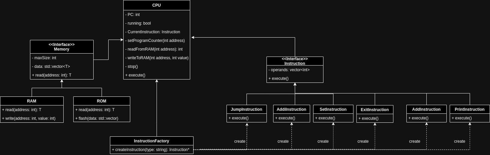

# CPU Task

## Problem Statement
The task is to design and simulate a basic CPU with RAM and ROM that can execute a set of predefined instructions. The CPU will read these instructions from a text file, store them in ROM, and execute them using memory addresses from RAM. The instructions supported include arithmetic operations (ADD, ADDI), control operations (EXIT, JMP), and utility operations (Print, Set).

## Design and Implementation

1. **CPU Class**:
    - **Function**: Acts as the central processing unit that fetches and executes instructions from ROM.
    - **Attributes**:
        - `programCounter`: Tracks the address of the next instruction to execute.
        - `running`: Indicates whether the CPU is actively running.
        - Pointers to `RAM` and `ROM` for memory operations.
    - **Methods**:
        - `initialize()`: Sets up the CPU with RAM and ROM.
        - `execute()`: Main loop that fetches and executes instructions.
        - `readFromMemory()` and `writeToMemory()`: Interfaces for memory operations.
        - `stop()`: Halts the execution of instructions.

2. **Memory Classes**:
    - **Abstract Class Memory**: Provides a common interface for different types of memory (RAM and ROM).
    - **RAM Class**:
        - Supports both read and write operations.
    - **ROM Class**:
        - Supports read operations and a special `flash()` method to load initial data.

3. **Instruction Classes**:
    - **Instruction (Abstract Class)**: Defines the interface for all instruction types, with an `execute()` method.
    - **Concrete Instruction Classes**:
        - Each implements the `execute()` method to perform specific operations.
        - Uses the CPU instance passed during construction for memory operations.

4. **InstructionFactory Class**:
    - **Function**: Responsible for creating instances of instruction classes based on the opcode.
    - **Methods**:
        - `createInstruction()`: Parses the instruction string, identifies the opcode, and creates the appropriate instruction instance.

### Instructions Supported

- **ADD P1 P2 P3**: Adds the values at memory addresses P1 and P2, stores the result at P3.
- **ADDI P1 immediate P3**: Adds the immediate value to the value at address P1, stores the result at P3.
- **EXIT**: Stops the execution of instructions.
- **JMP immediate**: Jumps to the instruction at the specified address.
- **PRINT P1**: Prints the value at address P1.
- **SET P1 immediate**: Sets the value at address P1 to the immediate value.

## Class Diagram
